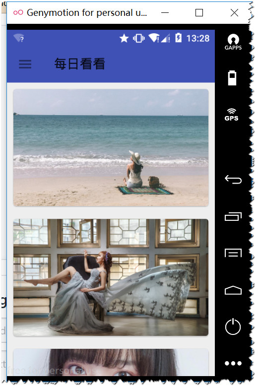
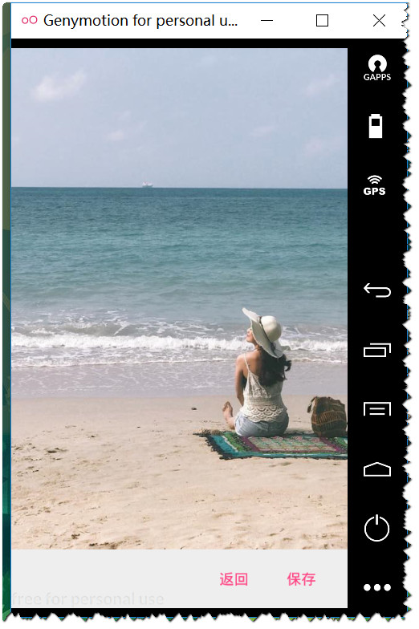
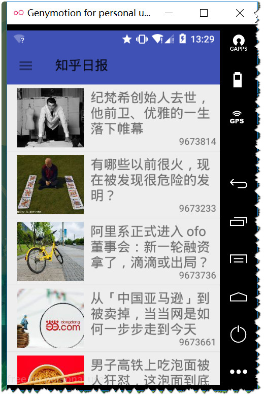
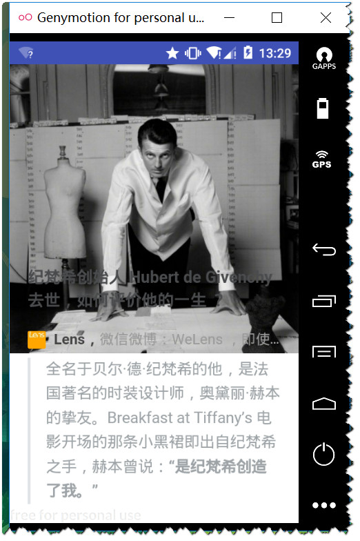
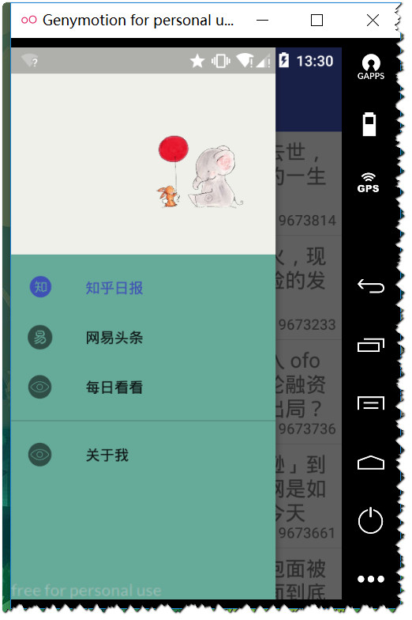

# CopyLookLook
简易知乎日报客户端 
<h5>这是一个知乎日报的简易客户端<h5> 
1. 包含了知乎日报板块【能够浏览查看知乎日报新闻】 
######2. 包含每日壁纸模块【将插卡每日壁纸，保存到本地】 
---
####使用到  JsonObject, Picasso, Okhttp等框架。 

 
 用到知识： 
  Fragment的替换，Recylerview[adapter, holder]的使用，Okhttp，JSONObject解析json   
  Okhttp，Picasso，CardView，动态请求权限，创建文件，文件夹，保存图片。 
  DrawerLayout，NavigationView，ToolBar 

  

数据来源： 知乎日报，gank.io壁纸板块。 
------
###截图：  

 
 
 
 
 

 
 CSDN地址 ：https://blog.csdn.net/dummyo/article/category/7427861
 
